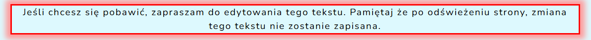
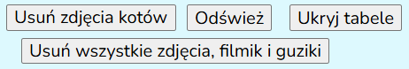

# My first webpage about my favourite animals

## You can review the page on the link bellow
https://patkolino.github.io/PracaDomowaM04/

## Website overview
The page is about some of my favourite animals, additional interesting facts regarding each of them as well as pictures. Additionally it includes a table with some basic information coresponding to each of the animals included. The page is in Polish. 

<image src="images/KittiesPreview.png" width="400px" height="600px">

## Project Overview
This page was created as part of the learning process for front-end development. Within this project, I have implemented the basics of **HTML**, **CSS** and **JavaScript** learned within the first 5 modules of the YouCode course I am attending. 

- HTML - the page is written in HTML
  - Document possess header, footer and it is divided into sections
  - Page includes navigation - allowing quick and easy access any desired section

- CSS - was used to further improve the page style, visibility and responsiveness.
  - Normalize.css library was included (https://cdnjs.com/libraries/normalize)
  - Desired font was included through Google fonts
  - The project was written following the BEM convention
  - Almost all the elements were additionally styled to improve the presentation of the page, without breaking responsivenes or readability making it presentable on all device types
  - Editable element is added where You can change what is written and have some fun
  

- JavaScript - allowing additional interactivity with the page
  - Some elements can be removed, some can be hidden or shown and page can be refreshed
